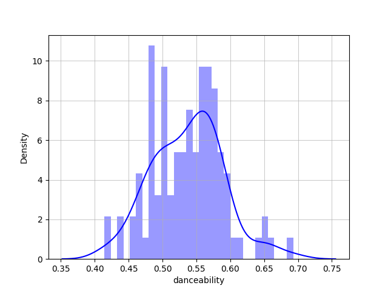

# シャレオツなタイトル

## あらすじ

前回の続きです。

## やること


レコメンド機能はこんな感じで作るつもり

`get_recommendations`に渡すパラメータを間接的な質問とかから取りたいので、有効な値の範囲が知りたい

なので、`distplot`とか`boxplot`で見てみる

### 対象データ

kaggleのSpotifyデータセット
100年分、17万曲からなら、妥当な結果か得られるはずだと思ったのでね

デカいデータを集めるのが面倒だったのでね

## やる

ソースここにおいてるよ

https://github.com/sayuyuyuyu/spotify_recommend/tree/develop

一番最初に思いついたヒストグラムからやってみます。

```python
import pandas as pd
import seaborn as sns
import matplotlib.pyplot as plt

def plot_create(param):
    # データをロード
    year_data = pd.read_csv('data/data_by_year.csv')
    # plotをリセット
    plt.clf()
    # ヒストグラム作成
    sns.distplot(a=year_data[param], bins=30,
                 hist=True, kde=True, color='blue')
    # 罫線を追加
    plt.grid(True, linewidth=0.5)
    # 指定ディレクトリに画像を保存
    save_path = 'pic/distplot_pic/'+param+'_dist.png'
    plt.savefig(save_path)

if __name__ == "__main__":
    # 音楽特徴パラメータのリスト
    sound_features = ['acousticness', 'danceability', 'energy', 'instrumentalness',
                      'liveness', 'loudness', 'popularity', 'speechiness', 'tempo', 'valence', 'key']

    # リストをぐるぐる回して画像作る
    for param in sound_features:
        plot_create(param)
```

`seaborn`のdistplotを用いました。

`bins`はヒストグラムの分割数

出力されたグラフはこんな感じ。x軸はパラメータの値でy軸は要素数になります。



ざっくり見ると山型なので、データとしては一貫性があって0.5~0.6あたりが平均になっていることが分かります。

ただ、歯抜けのように見える部分も多いので、信頼性があるかは微妙なことろです。

そんなんで、もっとざっくりと有効範囲知れる方法ないかな～と思ってたらありました。

**箱ひげ図**です。

というわけで書きました。distplotの部分をboxplotに変えただけですね。

```python
import pandas as pd
import seaborn as sns
import matplotlib.pyplot as plt

def plot_create(param):
    # データをロード
    year_data = pd.read_csv('data/data_by_year.csv')
    # plotをリセット
    plt.clf()
    # 箱ひげ図作成
    sns.boxplot(data=year_data[param])
    save_path = 'pic/boxplot_pic/'+param+'_box.png'
    plt.savefig(save_path)

if __name__ == "__main__":
    # 音楽特徴パラメータのリスト
    sound_features = ['acousticness', 'danceability', 'energy', 'instrumentalness',
                      'liveness', 'loudness', 'popularity', 'speechiness', 'tempo', 'valence', 'key']

    # リストをぐるぐる回して画像作る
    for param in sound_features:
        plot_create(param)
```

出たグラフはこんな感じ。


結構いいのでは？さっきよりも見やすいし0.70付近に外れ値があるのもわかります。

中央50%(25%~75%)が青の箱で、

というわけで箱ひげ図で各パラメータの中央値を算出してみました。結果はこんな感じ。

| Parameter Name | First Quartile | Second Quartile | Third Quartile |
| :------------- | -------------: | --------------: | -------------: |
| acousticness   |       0.289516 |         0.45919 |       0.856711 |
| danceability     |        0.5008    |         0.540976  |0.570948|
| energy           |        0.280733  |         0.495997  |    0.598008 |
| instrumentalness |        0.103323  |         0.127644  |    0.276707 |
| liveness         |        0.197509  |         0.206074  |    0.218493 |
| loudness         |      -14.1892    |       -11.7731    |    -9.95054  |
| popularity       |        3.2982    |        33.6193    |    44.9434   |
| speechiness      |        0.0642438 |         0.0857628 |    0.104438 |
| tempo            |      111.719     |       117.456     |    120.607    |
| valence          |        0.497174  |         0.541503  |    0.57008  |
| key              |        0         |         2         |    7        |

それぞれのやつがとれました。なんかいい感じだと思います。

### おまけ：今年聞いた曲の傾向を分析

12月の楽しみ、Spotifyまとめが発表されていたので簡単にデータを見ていきます。

